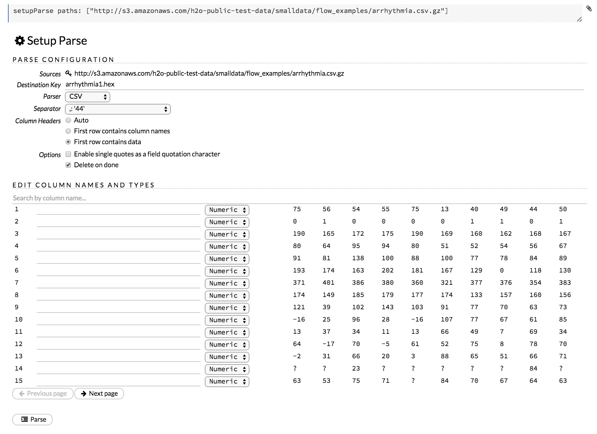

# PCA Tutorial

>Note: PCA is still in development in the current version of H2O. After development is complete, this document will be updated. 

<!---

This tutorial walks new users through the process of creating a Principal Components Analysis (PCA) model. 

Those who have never used H2O before should refer to <a href="https://github.com/h2oai/h2o-dev/blob/master/h2o-docs/src/product/flow/README.md" target="_blank">Getting Started</a> for additional instructions on how to run H2O Flow.

For more details on the math behind H2O's implementation of PCA, refer to <a href="http://docs.h2o.ai/datascience/pca.html" target="_blank">PCA Data Science</a>.

### When to Use PCA
PCA is used to reduce dimensions and solve issues of multicollinearity in high dimension data.

### Getting Started

This tutorial uses a publicly available data set that can be found at:
<a href="http://archive.ics.uci.edu/ml/datasets/Arrhythmia" target="_blank">http://archive.ics.uci.edu/ml/datasets/Arrhythmia</a>.

The original data are the Arrhythmia data set made available by UCI
Machine Learning Repository. They are composed of 452 observations and
279 attributes.

To further explore H2O's capabilities, some <a href="http://docs.h2o.ai/resources/publicdata.html" target="_blank">publicly available data sets</a> can be found on our website. 

####Importing Data
Before creating a model, import data into H2O:

0. Click the **Assist Me!** button in the *Help* tab in the sidebar on the right side of the page. 

  
0. Click the **importFiles** link and enter the file path to the dataset in the **Search** entry field, or drag and drop the file onto the **Search** entry field and press Enter to confirm the drop. 
0. Click the **Add all** link to add the file to the import queue, then click the **Import** button. 
  

####Parsing Data
Now, parse the imported data: 

0. Click the **Parse these files...** button. 
**Note**: The default options typically do not need to be changed unless the data does not parse correctly. 
0. From the drop-down **Parser** list, select the file type of the data set (Auto, XLS, CSV, or SVMLight). 
0. If the data uses a separator, select it from the drop-down **Separator** list. 
0. If the data uses a column header as the first row, select the **First row contains column names** radio button. If the first row contains data, select the **First row contains data** radio button. You can also select the **Auto** radio button to have H2O automatically determine if the first row of the dataset contains the column names or data. 
0. If the data uses apostrophes ( `'` - also known as single quotes), check the **Enable single quotes as a field quotation character** checkbox. 
0. To delete the imported dataset after the parse is complete, check the **Delete on done** checkbox. 

  **NOTE**: In general, we recommend enabling this option. Retaining data requires memory resources, but does not aid in modeling because unparsed data can’t be used by H2O.

0. Review the data in the **Data Preview** section, then click the **Parse** button.  

  

  **NOTE**: Make sure the parse is complete by clicking the **View Job** button and confirming progress is 100% before continuing to the next step, model building. For small datasets, this should only take a few seconds, but larger datasets take longer to parse.

### Building a Model

0. Once data are parsed, click the **View** button, then click the **Build Model** button. 
0. Select `Principal Component Analysis` from the drop-down **Select an algorithm** menu, then click the **Build model** button. 
0. If the parsed arrhythmia.hex file is not already listed in the **Training_frame** drop-down list, select it. Otherwise, continue to the next step. 
0. From the **Ignored_columns** section, select the columns to ignore in the *Available* area to move them to the *Selected* area. For this example, do not select any columns.  
0. In the **K** field, specify the number of clusters. For this example, enter `3`.  
0. In the **Max_iterations** field, specify the maximum number of iterations. For this example, enter `100`. 
0. From the drop-down **Init** menu, select the initialization mode. For this example, select **PlusPlus**. 
   - PlusPlus initialization chooses one initial center at random and weights the random selection of subsequent centers so that points furthest from the first center are more likely to be chosen. 
   - User initialization requires the corresponding **User_points** parameter. To define a specific initialization point, select the imported dataset .hex file from the drop-down **User_points** list, then select **User** from the drop-down **Init** list.
   
     **Note**: The user-specified points dataset must have the same number of columns as the training dataset.  

0. Click the **Build Model** button. 

### PCA Results

The output for PCA includes the following: 

- Output (model category, model summary, scoring history, training metrics, validation metrics, iterations)
- Archetypes
- Standard deviation
- Rotation 
- Importance of components

--> 
